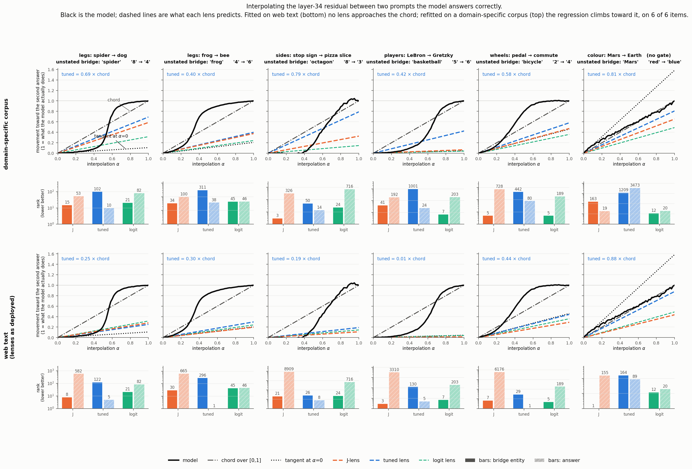
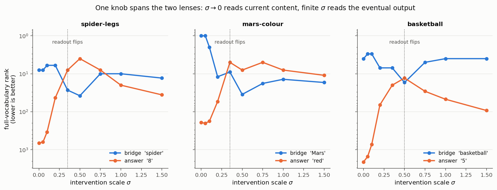

# What the Jacobian lens and the Tuned Lens each measure

Gemma 3 12B IT, layer 34. Code and full chronology in this directory;
preregistered criteria in `CLAIMS.md`, every result including the failures in
`LOG.md`.

## The two claims

The J-lens paper reports that on two-hop prompts the three lenses read out
different things. Neel Nanda's review proposes *why*. Those are separable, and
we test them separately.

**Claim 1 — the phenomenon.** At a layer where the model is holding an unspoken
intermediate, the **J-lens** reports the bridge entity, the **Tuned Lens**
skips ahead to the answer, and the **logit lens** sits in between.

**Claim 2 — the explanation.** The difference is *caused* by nonlinearity in
the remaining computation. Writing that computation as
$F_\ell : h_\ell \mapsto h_{\text{final}}$, the J-lens averages its local
Jacobian while the Tuned Lens regresses it globally. If $F_\ell$ were affine the
two would be *identical*, so the claim has real content only where $F_\ell$
bends.

## How we test them

Every probe is two-hop: the bridge entity is never named, so the model must
retrieve it before it can answer.

<p style="font-size:12px;color:#8a8880;margin:4px 0 10px">Grey tokens are shared by both prompts. Only the <span style="color:#eb6834">highlighted</span> run differs, and it never names the bridge entity — the model has to retrieve that before it can answer. The interpolation runs between the two residual streams these prompts produce.</p>
<div style="border:1px solid #00000014;border-radius:8px;padding:10px 12px;margin:8px 0;background:#fcfcfb">
  <div style="font-weight:600;font-size:13px;margin-bottom:6px;color:#0b0b0b">legs: spider → dog
    <span style="font-weight:400;color:#8a8880">&nbsp;·&nbsp;unstated bridge
    <code style="color:#eb6834">spider</code></span></div>
  <div style="line-height:2.0">
    <span style="color:#8a8880;font-size:11px;display:inline-block;width:34px">α=0</span>
    <span style="display:inline-block;padding:1px 5px;margin:1px;border-radius:4px;font-family:ui-monospace,SFMono-Regular,Menlo,monospace;font-size:12px;background:#00000008;border:1px solid #00000014;color:#8a8880">Fact</span><span style="display:inline-block;padding:1px 5px;margin:1px;border-radius:4px;font-family:ui-monospace,SFMono-Regular,Menlo,monospace;font-size:12px;background:#00000008;border:1px solid #00000014;color:#8a8880">:</span><span style="display:inline-block;padding:1px 5px;margin:1px;border-radius:4px;font-family:ui-monospace,SFMono-Regular,Menlo,monospace;font-size:12px;background:#00000008;border:1px solid #00000014;color:#8a8880">&nbsp;The</span><span style="display:inline-block;padding:1px 5px;margin:1px;border-radius:4px;font-family:ui-monospace,SFMono-Regular,Menlo,monospace;font-size:12px;background:#00000008;border:1px solid #00000014;color:#8a8880">&nbsp;number</span><span style="display:inline-block;padding:1px 5px;margin:1px;border-radius:4px;font-family:ui-monospace,SFMono-Regular,Menlo,monospace;font-size:12px;background:#00000008;border:1px solid #00000014;color:#8a8880">&nbsp;of</span><span style="display:inline-block;padding:1px 5px;margin:1px;border-radius:4px;font-family:ui-monospace,SFMono-Regular,Menlo,monospace;font-size:12px;background:#00000008;border:1px solid #00000014;color:#8a8880">&nbsp;legs</span><span style="display:inline-block;padding:1px 5px;margin:1px;border-radius:4px;font-family:ui-monospace,SFMono-Regular,Menlo,monospace;font-size:12px;background:#00000008;border:1px solid #00000014;color:#8a8880">&nbsp;on</span><span style="display:inline-block;padding:1px 5px;margin:1px;border-radius:4px;font-family:ui-monospace,SFMono-Regular,Menlo,monospace;font-size:12px;background:#00000008;border:1px solid #00000014;color:#8a8880">&nbsp;the</span><span style="display:inline-block;padding:1px 5px;margin:1px;border-radius:4px;font-family:ui-monospace,SFMono-Regular,Menlo,monospace;font-size:12px;background:#00000008;border:1px solid #00000014;color:#8a8880">&nbsp;animal</span><span style="display:inline-block;padding:1px 5px;margin:1px;border-radius:4px;font-family:ui-monospace,SFMono-Regular,Menlo,monospace;font-size:12px;background:#00000008;border:1px solid #00000014;color:#8a8880">&nbsp;that</span><span style="display:inline-block;padding:1px 5px;margin:1px;border-radius:4px;font-family:ui-monospace,SFMono-Regular,Menlo,monospace;font-size:12px;background:#eb683422;border:1px solid #eb683466;color:#0b0b0b">&nbsp;spins</span><span style="display:inline-block;padding:1px 5px;margin:1px;border-radius:4px;font-family:ui-monospace,SFMono-Regular,Menlo,monospace;font-size:12px;background:#eb683422;border:1px solid #eb683466;color:#0b0b0b">&nbsp;webs</span><span style="display:inline-block;padding:1px 5px;margin:1px;border-radius:4px;font-family:ui-monospace,SFMono-Regular,Menlo,monospace;font-size:12px;background:#00000008;border:1px solid #00000014;color:#8a8880">&nbsp;is</span><span style="display:inline-block;padding:1px 5px;margin:1px;border-radius:4px;font-family:ui-monospace,SFMono-Regular,Menlo,monospace;font-size:12px;background:#00000008;border:1px solid #00000014;color:#8a8880">&nbsp;</span>
    <span style="color:#8a8880">→</span>
    <b style="color:#eb6834">8</b>
  </div>
  <div style="line-height:2.0">
    <span style="color:#8a8880;font-size:11px;display:inline-block;width:34px">α=1</span>
    <span style="display:inline-block;padding:1px 5px;margin:1px;border-radius:4px;font-family:ui-monospace,SFMono-Regular,Menlo,monospace;font-size:12px;background:#00000008;border:1px solid #00000014;color:#8a8880">Fact</span><span style="display:inline-block;padding:1px 5px;margin:1px;border-radius:4px;font-family:ui-monospace,SFMono-Regular,Menlo,monospace;font-size:12px;background:#00000008;border:1px solid #00000014;color:#8a8880">:</span><span style="display:inline-block;padding:1px 5px;margin:1px;border-radius:4px;font-family:ui-monospace,SFMono-Regular,Menlo,monospace;font-size:12px;background:#00000008;border:1px solid #00000014;color:#8a8880">&nbsp;The</span><span style="display:inline-block;padding:1px 5px;margin:1px;border-radius:4px;font-family:ui-monospace,SFMono-Regular,Menlo,monospace;font-size:12px;background:#00000008;border:1px solid #00000014;color:#8a8880">&nbsp;number</span><span style="display:inline-block;padding:1px 5px;margin:1px;border-radius:4px;font-family:ui-monospace,SFMono-Regular,Menlo,monospace;font-size:12px;background:#00000008;border:1px solid #00000014;color:#8a8880">&nbsp;of</span><span style="display:inline-block;padding:1px 5px;margin:1px;border-radius:4px;font-family:ui-monospace,SFMono-Regular,Menlo,monospace;font-size:12px;background:#00000008;border:1px solid #00000014;color:#8a8880">&nbsp;legs</span><span style="display:inline-block;padding:1px 5px;margin:1px;border-radius:4px;font-family:ui-monospace,SFMono-Regular,Menlo,monospace;font-size:12px;background:#00000008;border:1px solid #00000014;color:#8a8880">&nbsp;on</span><span style="display:inline-block;padding:1px 5px;margin:1px;border-radius:4px;font-family:ui-monospace,SFMono-Regular,Menlo,monospace;font-size:12px;background:#00000008;border:1px solid #00000014;color:#8a8880">&nbsp;the</span><span style="display:inline-block;padding:1px 5px;margin:1px;border-radius:4px;font-family:ui-monospace,SFMono-Regular,Menlo,monospace;font-size:12px;background:#00000008;border:1px solid #00000014;color:#8a8880">&nbsp;animal</span><span style="display:inline-block;padding:1px 5px;margin:1px;border-radius:4px;font-family:ui-monospace,SFMono-Regular,Menlo,monospace;font-size:12px;background:#00000008;border:1px solid #00000014;color:#8a8880">&nbsp;that</span><span style="display:inline-block;padding:1px 5px;margin:1px;border-radius:4px;font-family:ui-monospace,SFMono-Regular,Menlo,monospace;font-size:12px;background:#2a78d622;border:1px solid #2a78d666;color:#0b0b0b">&nbsp;b</span><span style="display:inline-block;padding:1px 5px;margin:1px;border-radius:4px;font-family:ui-monospace,SFMono-Regular,Menlo,monospace;font-size:12px;background:#2a78d622;border:1px solid #2a78d666;color:#0b0b0b">arks</span><span style="display:inline-block;padding:1px 5px;margin:1px;border-radius:4px;font-family:ui-monospace,SFMono-Regular,Menlo,monospace;font-size:12px;background:#2a78d622;border:1px solid #2a78d666;color:#0b0b0b">&nbsp;and</span><span style="display:inline-block;padding:1px 5px;margin:1px;border-radius:4px;font-family:ui-monospace,SFMono-Regular,Menlo,monospace;font-size:12px;background:#2a78d622;border:1px solid #2a78d666;color:#0b0b0b">&nbsp;fetches</span><span style="display:inline-block;padding:1px 5px;margin:1px;border-radius:4px;font-family:ui-monospace,SFMono-Regular,Menlo,monospace;font-size:12px;background:#2a78d622;border:1px solid #2a78d666;color:#0b0b0b">&nbsp;sticks</span><span style="display:inline-block;padding:1px 5px;margin:1px;border-radius:4px;font-family:ui-monospace,SFMono-Regular,Menlo,monospace;font-size:12px;background:#00000008;border:1px solid #00000014;color:#8a8880">&nbsp;is</span><span style="display:inline-block;padding:1px 5px;margin:1px;border-radius:4px;font-family:ui-monospace,SFMono-Regular,Menlo,monospace;font-size:12px;background:#00000008;border:1px solid #00000014;color:#8a8880">&nbsp;</span>
    <span style="color:#8a8880">→</span>
    <b style="color:#2a78d6">4</b>
  </div>
</div>
<div style="border:1px solid #00000014;border-radius:8px;padding:10px 12px;margin:8px 0;background:#fcfcfb">
  <div style="font-weight:600;font-size:13px;margin-bottom:6px;color:#0b0b0b">legs: frog → bee
    <span style="font-weight:400;color:#8a8880">&nbsp;·&nbsp;unstated bridge
    <code style="color:#eb6834">frog</code></span></div>
  <div style="line-height:2.0">
    <span style="color:#8a8880;font-size:11px;display:inline-block;width:34px">α=0</span>
    <span style="display:inline-block;padding:1px 5px;margin:1px;border-radius:4px;font-family:ui-monospace,SFMono-Regular,Menlo,monospace;font-size:12px;background:#00000008;border:1px solid #00000014;color:#8a8880">Fact</span><span style="display:inline-block;padding:1px 5px;margin:1px;border-radius:4px;font-family:ui-monospace,SFMono-Regular,Menlo,monospace;font-size:12px;background:#00000008;border:1px solid #00000014;color:#8a8880">:</span><span style="display:inline-block;padding:1px 5px;margin:1px;border-radius:4px;font-family:ui-monospace,SFMono-Regular,Menlo,monospace;font-size:12px;background:#00000008;border:1px solid #00000014;color:#8a8880">&nbsp;The</span><span style="display:inline-block;padding:1px 5px;margin:1px;border-radius:4px;font-family:ui-monospace,SFMono-Regular,Menlo,monospace;font-size:12px;background:#00000008;border:1px solid #00000014;color:#8a8880">&nbsp;number</span><span style="display:inline-block;padding:1px 5px;margin:1px;border-radius:4px;font-family:ui-monospace,SFMono-Regular,Menlo,monospace;font-size:12px;background:#00000008;border:1px solid #00000014;color:#8a8880">&nbsp;of</span><span style="display:inline-block;padding:1px 5px;margin:1px;border-radius:4px;font-family:ui-monospace,SFMono-Regular,Menlo,monospace;font-size:12px;background:#00000008;border:1px solid #00000014;color:#8a8880">&nbsp;legs</span><span style="display:inline-block;padding:1px 5px;margin:1px;border-radius:4px;font-family:ui-monospace,SFMono-Regular,Menlo,monospace;font-size:12px;background:#00000008;border:1px solid #00000014;color:#8a8880">&nbsp;on</span><span style="display:inline-block;padding:1px 5px;margin:1px;border-radius:4px;font-family:ui-monospace,SFMono-Regular,Menlo,monospace;font-size:12px;background:#00000008;border:1px solid #00000014;color:#8a8880">&nbsp;the</span><span style="display:inline-block;padding:1px 5px;margin:1px;border-radius:4px;font-family:ui-monospace,SFMono-Regular,Menlo,monospace;font-size:12px;background:#00000008;border:1px solid #00000014;color:#8a8880">&nbsp;animal</span><span style="display:inline-block;padding:1px 5px;margin:1px;border-radius:4px;font-family:ui-monospace,SFMono-Regular,Menlo,monospace;font-size:12px;background:#00000008;border:1px solid #00000014;color:#8a8880">&nbsp;that</span><span style="display:inline-block;padding:1px 5px;margin:1px;border-radius:4px;font-family:ui-monospace,SFMono-Regular,Menlo,monospace;font-size:12px;background:#eb683422;border:1px solid #eb683466;color:#0b0b0b">&nbsp;cro</span><span style="display:inline-block;padding:1px 5px;margin:1px;border-radius:4px;font-family:ui-monospace,SFMono-Regular,Menlo,monospace;font-size:12px;background:#eb683422;border:1px solid #eb683466;color:#0b0b0b">aks</span><span style="display:inline-block;padding:1px 5px;margin:1px;border-radius:4px;font-family:ui-monospace,SFMono-Regular,Menlo,monospace;font-size:12px;background:#eb683422;border:1px solid #eb683466;color:#0b0b0b">&nbsp;by</span><span style="display:inline-block;padding:1px 5px;margin:1px;border-radius:4px;font-family:ui-monospace,SFMono-Regular,Menlo,monospace;font-size:12px;background:#eb683422;border:1px solid #eb683466;color:#0b0b0b">&nbsp;the</span><span style="display:inline-block;padding:1px 5px;margin:1px;border-radius:4px;font-family:ui-monospace,SFMono-Regular,Menlo,monospace;font-size:12px;background:#eb683422;border:1px solid #eb683466;color:#0b0b0b">&nbsp;pond</span><span style="display:inline-block;padding:1px 5px;margin:1px;border-radius:4px;font-family:ui-monospace,SFMono-Regular,Menlo,monospace;font-size:12px;background:#00000008;border:1px solid #00000014;color:#8a8880">&nbsp;is</span><span style="display:inline-block;padding:1px 5px;margin:1px;border-radius:4px;font-family:ui-monospace,SFMono-Regular,Menlo,monospace;font-size:12px;background:#00000008;border:1px solid #00000014;color:#8a8880">&nbsp;</span>
    <span style="color:#8a8880">→</span>
    <b style="color:#eb6834">4</b>
  </div>
  <div style="line-height:2.0">
    <span style="color:#8a8880;font-size:11px;display:inline-block;width:34px">α=1</span>
    <span style="display:inline-block;padding:1px 5px;margin:1px;border-radius:4px;font-family:ui-monospace,SFMono-Regular,Menlo,monospace;font-size:12px;background:#00000008;border:1px solid #00000014;color:#8a8880">Fact</span><span style="display:inline-block;padding:1px 5px;margin:1px;border-radius:4px;font-family:ui-monospace,SFMono-Regular,Menlo,monospace;font-size:12px;background:#00000008;border:1px solid #00000014;color:#8a8880">:</span><span style="display:inline-block;padding:1px 5px;margin:1px;border-radius:4px;font-family:ui-monospace,SFMono-Regular,Menlo,monospace;font-size:12px;background:#00000008;border:1px solid #00000014;color:#8a8880">&nbsp;The</span><span style="display:inline-block;padding:1px 5px;margin:1px;border-radius:4px;font-family:ui-monospace,SFMono-Regular,Menlo,monospace;font-size:12px;background:#00000008;border:1px solid #00000014;color:#8a8880">&nbsp;number</span><span style="display:inline-block;padding:1px 5px;margin:1px;border-radius:4px;font-family:ui-monospace,SFMono-Regular,Menlo,monospace;font-size:12px;background:#00000008;border:1px solid #00000014;color:#8a8880">&nbsp;of</span><span style="display:inline-block;padding:1px 5px;margin:1px;border-radius:4px;font-family:ui-monospace,SFMono-Regular,Menlo,monospace;font-size:12px;background:#00000008;border:1px solid #00000014;color:#8a8880">&nbsp;legs</span><span style="display:inline-block;padding:1px 5px;margin:1px;border-radius:4px;font-family:ui-monospace,SFMono-Regular,Menlo,monospace;font-size:12px;background:#00000008;border:1px solid #00000014;color:#8a8880">&nbsp;on</span><span style="display:inline-block;padding:1px 5px;margin:1px;border-radius:4px;font-family:ui-monospace,SFMono-Regular,Menlo,monospace;font-size:12px;background:#00000008;border:1px solid #00000014;color:#8a8880">&nbsp;the</span><span style="display:inline-block;padding:1px 5px;margin:1px;border-radius:4px;font-family:ui-monospace,SFMono-Regular,Menlo,monospace;font-size:12px;background:#00000008;border:1px solid #00000014;color:#8a8880">&nbsp;animal</span><span style="display:inline-block;padding:1px 5px;margin:1px;border-radius:4px;font-family:ui-monospace,SFMono-Regular,Menlo,monospace;font-size:12px;background:#00000008;border:1px solid #00000014;color:#8a8880">&nbsp;that</span><span style="display:inline-block;padding:1px 5px;margin:1px;border-radius:4px;font-family:ui-monospace,SFMono-Regular,Menlo,monospace;font-size:12px;background:#2a78d622;border:1px solid #2a78d666;color:#0b0b0b">&nbsp;buzz</span><span style="display:inline-block;padding:1px 5px;margin:1px;border-radius:4px;font-family:ui-monospace,SFMono-Regular,Menlo,monospace;font-size:12px;background:#2a78d622;border:1px solid #2a78d666;color:#0b0b0b">es</span><span style="display:inline-block;padding:1px 5px;margin:1px;border-radius:4px;font-family:ui-monospace,SFMono-Regular,Menlo,monospace;font-size:12px;background:#2a78d622;border:1px solid #2a78d666;color:#0b0b0b">&nbsp;and</span><span style="display:inline-block;padding:1px 5px;margin:1px;border-radius:4px;font-family:ui-monospace,SFMono-Regular,Menlo,monospace;font-size:12px;background:#2a78d622;border:1px solid #2a78d666;color:#0b0b0b">&nbsp;makes</span><span style="display:inline-block;padding:1px 5px;margin:1px;border-radius:4px;font-family:ui-monospace,SFMono-Regular,Menlo,monospace;font-size:12px;background:#2a78d622;border:1px solid #2a78d666;color:#0b0b0b">&nbsp;honey</span><span style="display:inline-block;padding:1px 5px;margin:1px;border-radius:4px;font-family:ui-monospace,SFMono-Regular,Menlo,monospace;font-size:12px;background:#00000008;border:1px solid #00000014;color:#8a8880">&nbsp;is</span><span style="display:inline-block;padding:1px 5px;margin:1px;border-radius:4px;font-family:ui-monospace,SFMono-Regular,Menlo,monospace;font-size:12px;background:#00000008;border:1px solid #00000014;color:#8a8880">&nbsp;</span>
    <span style="color:#8a8880">→</span>
    <b style="color:#2a78d6">6</b>
  </div>
</div>
<div style="border:1px solid #00000014;border-radius:8px;padding:10px 12px;margin:8px 0;background:#fcfcfb">
  <div style="font-weight:600;font-size:13px;margin-bottom:6px;color:#0b0b0b">sides: stop sign → pizza slice
    <span style="font-weight:400;color:#8a8880">&nbsp;·&nbsp;unstated bridge
    <code style="color:#eb6834">octagon</code></span></div>
  <div style="line-height:2.0">
    <span style="color:#8a8880;font-size:11px;display:inline-block;width:34px">α=0</span>
    <span style="display:inline-block;padding:1px 5px;margin:1px;border-radius:4px;font-family:ui-monospace,SFMono-Regular,Menlo,monospace;font-size:12px;background:#00000008;border:1px solid #00000014;color:#8a8880">Fact</span><span style="display:inline-block;padding:1px 5px;margin:1px;border-radius:4px;font-family:ui-monospace,SFMono-Regular,Menlo,monospace;font-size:12px;background:#00000008;border:1px solid #00000014;color:#8a8880">:</span><span style="display:inline-block;padding:1px 5px;margin:1px;border-radius:4px;font-family:ui-monospace,SFMono-Regular,Menlo,monospace;font-size:12px;background:#00000008;border:1px solid #00000014;color:#8a8880">&nbsp;The</span><span style="display:inline-block;padding:1px 5px;margin:1px;border-radius:4px;font-family:ui-monospace,SFMono-Regular,Menlo,monospace;font-size:12px;background:#00000008;border:1px solid #00000014;color:#8a8880">&nbsp;number</span><span style="display:inline-block;padding:1px 5px;margin:1px;border-radius:4px;font-family:ui-monospace,SFMono-Regular,Menlo,monospace;font-size:12px;background:#00000008;border:1px solid #00000014;color:#8a8880">&nbsp;of</span><span style="display:inline-block;padding:1px 5px;margin:1px;border-radius:4px;font-family:ui-monospace,SFMono-Regular,Menlo,monospace;font-size:12px;background:#00000008;border:1px solid #00000014;color:#8a8880">&nbsp;sides</span><span style="display:inline-block;padding:1px 5px;margin:1px;border-radius:4px;font-family:ui-monospace,SFMono-Regular,Menlo,monospace;font-size:12px;background:#00000008;border:1px solid #00000014;color:#8a8880">&nbsp;on</span><span style="display:inline-block;padding:1px 5px;margin:1px;border-radius:4px;font-family:ui-monospace,SFMono-Regular,Menlo,monospace;font-size:12px;background:#00000008;border:1px solid #00000014;color:#8a8880">&nbsp;the</span><span style="display:inline-block;padding:1px 5px;margin:1px;border-radius:4px;font-family:ui-monospace,SFMono-Regular,Menlo,monospace;font-size:12px;background:#00000008;border:1px solid #00000014;color:#8a8880">&nbsp;shape</span><span style="display:inline-block;padding:1px 5px;margin:1px;border-radius:4px;font-family:ui-monospace,SFMono-Regular,Menlo,monospace;font-size:12px;background:#00000008;border:1px solid #00000014;color:#8a8880">&nbsp;of</span><span style="display:inline-block;padding:1px 5px;margin:1px;border-radius:4px;font-family:ui-monospace,SFMono-Regular,Menlo,monospace;font-size:12px;background:#00000008;border:1px solid #00000014;color:#8a8880">&nbsp;a</span><span style="display:inline-block;padding:1px 5px;margin:1px;border-radius:4px;font-family:ui-monospace,SFMono-Regular,Menlo,monospace;font-size:12px;background:#eb683422;border:1px solid #eb683466;color:#0b0b0b">&nbsp;stop</span><span style="display:inline-block;padding:1px 5px;margin:1px;border-radius:4px;font-family:ui-monospace,SFMono-Regular,Menlo,monospace;font-size:12px;background:#eb683422;border:1px solid #eb683466;color:#0b0b0b">&nbsp;sign</span><span style="display:inline-block;padding:1px 5px;margin:1px;border-radius:4px;font-family:ui-monospace,SFMono-Regular,Menlo,monospace;font-size:12px;background:#00000008;border:1px solid #00000014;color:#8a8880">&nbsp;is</span><span style="display:inline-block;padding:1px 5px;margin:1px;border-radius:4px;font-family:ui-monospace,SFMono-Regular,Menlo,monospace;font-size:12px;background:#00000008;border:1px solid #00000014;color:#8a8880">&nbsp;</span>
    <span style="color:#8a8880">→</span>
    <b style="color:#eb6834">8</b>
  </div>
  <div style="line-height:2.0">
    <span style="color:#8a8880;font-size:11px;display:inline-block;width:34px">α=1</span>
    <span style="display:inline-block;padding:1px 5px;margin:1px;border-radius:4px;font-family:ui-monospace,SFMono-Regular,Menlo,monospace;font-size:12px;background:#00000008;border:1px solid #00000014;color:#8a8880">Fact</span><span style="display:inline-block;padding:1px 5px;margin:1px;border-radius:4px;font-family:ui-monospace,SFMono-Regular,Menlo,monospace;font-size:12px;background:#00000008;border:1px solid #00000014;color:#8a8880">:</span><span style="display:inline-block;padding:1px 5px;margin:1px;border-radius:4px;font-family:ui-monospace,SFMono-Regular,Menlo,monospace;font-size:12px;background:#00000008;border:1px solid #00000014;color:#8a8880">&nbsp;The</span><span style="display:inline-block;padding:1px 5px;margin:1px;border-radius:4px;font-family:ui-monospace,SFMono-Regular,Menlo,monospace;font-size:12px;background:#00000008;border:1px solid #00000014;color:#8a8880">&nbsp;number</span><span style="display:inline-block;padding:1px 5px;margin:1px;border-radius:4px;font-family:ui-monospace,SFMono-Regular,Menlo,monospace;font-size:12px;background:#00000008;border:1px solid #00000014;color:#8a8880">&nbsp;of</span><span style="display:inline-block;padding:1px 5px;margin:1px;border-radius:4px;font-family:ui-monospace,SFMono-Regular,Menlo,monospace;font-size:12px;background:#00000008;border:1px solid #00000014;color:#8a8880">&nbsp;sides</span><span style="display:inline-block;padding:1px 5px;margin:1px;border-radius:4px;font-family:ui-monospace,SFMono-Regular,Menlo,monospace;font-size:12px;background:#00000008;border:1px solid #00000014;color:#8a8880">&nbsp;on</span><span style="display:inline-block;padding:1px 5px;margin:1px;border-radius:4px;font-family:ui-monospace,SFMono-Regular,Menlo,monospace;font-size:12px;background:#00000008;border:1px solid #00000014;color:#8a8880">&nbsp;the</span><span style="display:inline-block;padding:1px 5px;margin:1px;border-radius:4px;font-family:ui-monospace,SFMono-Regular,Menlo,monospace;font-size:12px;background:#00000008;border:1px solid #00000014;color:#8a8880">&nbsp;shape</span><span style="display:inline-block;padding:1px 5px;margin:1px;border-radius:4px;font-family:ui-monospace,SFMono-Regular,Menlo,monospace;font-size:12px;background:#00000008;border:1px solid #00000014;color:#8a8880">&nbsp;of</span><span style="display:inline-block;padding:1px 5px;margin:1px;border-radius:4px;font-family:ui-monospace,SFMono-Regular,Menlo,monospace;font-size:12px;background:#00000008;border:1px solid #00000014;color:#8a8880">&nbsp;a</span><span style="display:inline-block;padding:1px 5px;margin:1px;border-radius:4px;font-family:ui-monospace,SFMono-Regular,Menlo,monospace;font-size:12px;background:#2a78d622;border:1px solid #2a78d666;color:#0b0b0b">&nbsp;slice</span><span style="display:inline-block;padding:1px 5px;margin:1px;border-radius:4px;font-family:ui-monospace,SFMono-Regular,Menlo,monospace;font-size:12px;background:#2a78d622;border:1px solid #2a78d666;color:#0b0b0b">&nbsp;of</span><span style="display:inline-block;padding:1px 5px;margin:1px;border-radius:4px;font-family:ui-monospace,SFMono-Regular,Menlo,monospace;font-size:12px;background:#2a78d622;border:1px solid #2a78d666;color:#0b0b0b">&nbsp;pizza</span><span style="display:inline-block;padding:1px 5px;margin:1px;border-radius:4px;font-family:ui-monospace,SFMono-Regular,Menlo,monospace;font-size:12px;background:#00000008;border:1px solid #00000014;color:#8a8880">&nbsp;is</span><span style="display:inline-block;padding:1px 5px;margin:1px;border-radius:4px;font-family:ui-monospace,SFMono-Regular,Menlo,monospace;font-size:12px;background:#00000008;border:1px solid #00000014;color:#8a8880">&nbsp;</span>
    <span style="color:#8a8880">→</span>
    <b style="color:#2a78d6">3</b>
  </div>
</div>
<div style="border:1px solid #00000014;border-radius:8px;padding:10px 12px;margin:8px 0;background:#fcfcfb">
  <div style="font-weight:600;font-size:13px;margin-bottom:6px;color:#0b0b0b">players: LeBron → Gretzky
    <span style="font-weight:400;color:#8a8880">&nbsp;·&nbsp;unstated bridge
    <code style="color:#eb6834">basketball</code></span></div>
  <div style="line-height:2.0">
    <span style="color:#8a8880;font-size:11px;display:inline-block;width:34px">α=0</span>
    <span style="display:inline-block;padding:1px 5px;margin:1px;border-radius:4px;font-family:ui-monospace,SFMono-Regular,Menlo,monospace;font-size:12px;background:#00000008;border:1px solid #00000014;color:#8a8880">Fact</span><span style="display:inline-block;padding:1px 5px;margin:1px;border-radius:4px;font-family:ui-monospace,SFMono-Regular,Menlo,monospace;font-size:12px;background:#00000008;border:1px solid #00000014;color:#8a8880">:</span><span style="display:inline-block;padding:1px 5px;margin:1px;border-radius:4px;font-family:ui-monospace,SFMono-Regular,Menlo,monospace;font-size:12px;background:#00000008;border:1px solid #00000014;color:#8a8880">&nbsp;The</span><span style="display:inline-block;padding:1px 5px;margin:1px;border-radius:4px;font-family:ui-monospace,SFMono-Regular,Menlo,monospace;font-size:12px;background:#00000008;border:1px solid #00000014;color:#8a8880">&nbsp;number</span><span style="display:inline-block;padding:1px 5px;margin:1px;border-radius:4px;font-family:ui-monospace,SFMono-Regular,Menlo,monospace;font-size:12px;background:#00000008;border:1px solid #00000014;color:#8a8880">&nbsp;of</span><span style="display:inline-block;padding:1px 5px;margin:1px;border-radius:4px;font-family:ui-monospace,SFMono-Regular,Menlo,monospace;font-size:12px;background:#00000008;border:1px solid #00000014;color:#8a8880">&nbsp;players</span><span style="display:inline-block;padding:1px 5px;margin:1px;border-radius:4px;font-family:ui-monospace,SFMono-Regular,Menlo,monospace;font-size:12px;background:#00000008;border:1px solid #00000014;color:#8a8880">&nbsp;on</span><span style="display:inline-block;padding:1px 5px;margin:1px;border-radius:4px;font-family:ui-monospace,SFMono-Regular,Menlo,monospace;font-size:12px;background:#00000008;border:1px solid #00000014;color:#8a8880">&nbsp;one</span><span style="display:inline-block;padding:1px 5px;margin:1px;border-radius:4px;font-family:ui-monospace,SFMono-Regular,Menlo,monospace;font-size:12px;background:#00000008;border:1px solid #00000014;color:#8a8880">&nbsp;team</span><span style="display:inline-block;padding:1px 5px;margin:1px;border-radius:4px;font-family:ui-monospace,SFMono-Regular,Menlo,monospace;font-size:12px;background:#00000008;border:1px solid #00000014;color:#8a8880">&nbsp;in</span><span style="display:inline-block;padding:1px 5px;margin:1px;border-radius:4px;font-family:ui-monospace,SFMono-Regular,Menlo,monospace;font-size:12px;background:#00000008;border:1px solid #00000014;color:#8a8880">&nbsp;the</span><span style="display:inline-block;padding:1px 5px;margin:1px;border-radius:4px;font-family:ui-monospace,SFMono-Regular,Menlo,monospace;font-size:12px;background:#00000008;border:1px solid #00000014;color:#8a8880">&nbsp;sport</span><span style="display:inline-block;padding:1px 5px;margin:1px;border-radius:4px;font-family:ui-monospace,SFMono-Regular,Menlo,monospace;font-size:12px;background:#eb683422;border:1px solid #eb683466;color:#0b0b0b">&nbsp;LeBron</span><span style="display:inline-block;padding:1px 5px;margin:1px;border-radius:4px;font-family:ui-monospace,SFMono-Regular,Menlo,monospace;font-size:12px;background:#eb683422;border:1px solid #eb683466;color:#0b0b0b">&nbsp;James</span><span style="display:inline-block;padding:1px 5px;margin:1px;border-radius:4px;font-family:ui-monospace,SFMono-Regular,Menlo,monospace;font-size:12px;background:#eb683422;border:1px solid #eb683466;color:#0b0b0b">&nbsp;plays</span><span style="display:inline-block;padding:1px 5px;margin:1px;border-radius:4px;font-family:ui-monospace,SFMono-Regular,Menlo,monospace;font-size:12px;background:#00000008;border:1px solid #00000014;color:#8a8880">&nbsp;is</span><span style="display:inline-block;padding:1px 5px;margin:1px;border-radius:4px;font-family:ui-monospace,SFMono-Regular,Menlo,monospace;font-size:12px;background:#00000008;border:1px solid #00000014;color:#8a8880">&nbsp;</span>
    <span style="color:#8a8880">→</span>
    <b style="color:#eb6834">5</b>
  </div>
  <div style="line-height:2.0">
    <span style="color:#8a8880;font-size:11px;display:inline-block;width:34px">α=1</span>
    <span style="display:inline-block;padding:1px 5px;margin:1px;border-radius:4px;font-family:ui-monospace,SFMono-Regular,Menlo,monospace;font-size:12px;background:#00000008;border:1px solid #00000014;color:#8a8880">Fact</span><span style="display:inline-block;padding:1px 5px;margin:1px;border-radius:4px;font-family:ui-monospace,SFMono-Regular,Menlo,monospace;font-size:12px;background:#00000008;border:1px solid #00000014;color:#8a8880">:</span><span style="display:inline-block;padding:1px 5px;margin:1px;border-radius:4px;font-family:ui-monospace,SFMono-Regular,Menlo,monospace;font-size:12px;background:#00000008;border:1px solid #00000014;color:#8a8880">&nbsp;The</span><span style="display:inline-block;padding:1px 5px;margin:1px;border-radius:4px;font-family:ui-monospace,SFMono-Regular,Menlo,monospace;font-size:12px;background:#00000008;border:1px solid #00000014;color:#8a8880">&nbsp;number</span><span style="display:inline-block;padding:1px 5px;margin:1px;border-radius:4px;font-family:ui-monospace,SFMono-Regular,Menlo,monospace;font-size:12px;background:#00000008;border:1px solid #00000014;color:#8a8880">&nbsp;of</span><span style="display:inline-block;padding:1px 5px;margin:1px;border-radius:4px;font-family:ui-monospace,SFMono-Regular,Menlo,monospace;font-size:12px;background:#00000008;border:1px solid #00000014;color:#8a8880">&nbsp;players</span><span style="display:inline-block;padding:1px 5px;margin:1px;border-radius:4px;font-family:ui-monospace,SFMono-Regular,Menlo,monospace;font-size:12px;background:#00000008;border:1px solid #00000014;color:#8a8880">&nbsp;on</span><span style="display:inline-block;padding:1px 5px;margin:1px;border-radius:4px;font-family:ui-monospace,SFMono-Regular,Menlo,monospace;font-size:12px;background:#00000008;border:1px solid #00000014;color:#8a8880">&nbsp;one</span><span style="display:inline-block;padding:1px 5px;margin:1px;border-radius:4px;font-family:ui-monospace,SFMono-Regular,Menlo,monospace;font-size:12px;background:#00000008;border:1px solid #00000014;color:#8a8880">&nbsp;team</span><span style="display:inline-block;padding:1px 5px;margin:1px;border-radius:4px;font-family:ui-monospace,SFMono-Regular,Menlo,monospace;font-size:12px;background:#00000008;border:1px solid #00000014;color:#8a8880">&nbsp;in</span><span style="display:inline-block;padding:1px 5px;margin:1px;border-radius:4px;font-family:ui-monospace,SFMono-Regular,Menlo,monospace;font-size:12px;background:#00000008;border:1px solid #00000014;color:#8a8880">&nbsp;the</span><span style="display:inline-block;padding:1px 5px;margin:1px;border-radius:4px;font-family:ui-monospace,SFMono-Regular,Menlo,monospace;font-size:12px;background:#00000008;border:1px solid #00000014;color:#8a8880">&nbsp;sport</span><span style="display:inline-block;padding:1px 5px;margin:1px;border-radius:4px;font-family:ui-monospace,SFMono-Regular,Menlo,monospace;font-size:12px;background:#2a78d622;border:1px solid #2a78d666;color:#0b0b0b">&nbsp;Wayne</span><span style="display:inline-block;padding:1px 5px;margin:1px;border-radius:4px;font-family:ui-monospace,SFMono-Regular,Menlo,monospace;font-size:12px;background:#2a78d622;border:1px solid #2a78d666;color:#0b0b0b">&nbsp;Gret</span><span style="display:inline-block;padding:1px 5px;margin:1px;border-radius:4px;font-family:ui-monospace,SFMono-Regular,Menlo,monospace;font-size:12px;background:#2a78d622;border:1px solid #2a78d666;color:#0b0b0b">zky</span><span style="display:inline-block;padding:1px 5px;margin:1px;border-radius:4px;font-family:ui-monospace,SFMono-Regular,Menlo,monospace;font-size:12px;background:#2a78d622;border:1px solid #2a78d666;color:#0b0b0b">&nbsp;played</span><span style="display:inline-block;padding:1px 5px;margin:1px;border-radius:4px;font-family:ui-monospace,SFMono-Regular,Menlo,monospace;font-size:12px;background:#00000008;border:1px solid #00000014;color:#8a8880">&nbsp;is</span><span style="display:inline-block;padding:1px 5px;margin:1px;border-radius:4px;font-family:ui-monospace,SFMono-Regular,Menlo,monospace;font-size:12px;background:#00000008;border:1px solid #00000014;color:#8a8880">&nbsp;</span>
    <span style="color:#8a8880">→</span>
    <b style="color:#2a78d6">6</b>
  </div>
</div>
<div style="border:1px solid #00000014;border-radius:8px;padding:10px 12px;margin:8px 0;background:#fcfcfb">
  <div style="font-weight:600;font-size:13px;margin-bottom:6px;color:#0b0b0b">wheels: pedal → commute
    <span style="font-weight:400;color:#8a8880">&nbsp;·&nbsp;unstated bridge
    <code style="color:#eb6834">bicycle</code></span></div>
  <div style="line-height:2.0">
    <span style="color:#8a8880;font-size:11px;display:inline-block;width:34px">α=0</span>
    <span style="display:inline-block;padding:1px 5px;margin:1px;border-radius:4px;font-family:ui-monospace,SFMono-Regular,Menlo,monospace;font-size:12px;background:#00000008;border:1px solid #00000014;color:#8a8880">Fact</span><span style="display:inline-block;padding:1px 5px;margin:1px;border-radius:4px;font-family:ui-monospace,SFMono-Regular,Menlo,monospace;font-size:12px;background:#00000008;border:1px solid #00000014;color:#8a8880">:</span><span style="display:inline-block;padding:1px 5px;margin:1px;border-radius:4px;font-family:ui-monospace,SFMono-Regular,Menlo,monospace;font-size:12px;background:#00000008;border:1px solid #00000014;color:#8a8880">&nbsp;The</span><span style="display:inline-block;padding:1px 5px;margin:1px;border-radius:4px;font-family:ui-monospace,SFMono-Regular,Menlo,monospace;font-size:12px;background:#00000008;border:1px solid #00000014;color:#8a8880">&nbsp;number</span><span style="display:inline-block;padding:1px 5px;margin:1px;border-radius:4px;font-family:ui-monospace,SFMono-Regular,Menlo,monospace;font-size:12px;background:#00000008;border:1px solid #00000014;color:#8a8880">&nbsp;of</span><span style="display:inline-block;padding:1px 5px;margin:1px;border-radius:4px;font-family:ui-monospace,SFMono-Regular,Menlo,monospace;font-size:12px;background:#00000008;border:1px solid #00000014;color:#8a8880">&nbsp;wheels</span><span style="display:inline-block;padding:1px 5px;margin:1px;border-radius:4px;font-family:ui-monospace,SFMono-Regular,Menlo,monospace;font-size:12px;background:#00000008;border:1px solid #00000014;color:#8a8880">&nbsp;on</span><span style="display:inline-block;padding:1px 5px;margin:1px;border-radius:4px;font-family:ui-monospace,SFMono-Regular,Menlo,monospace;font-size:12px;background:#00000008;border:1px solid #00000014;color:#8a8880">&nbsp;the</span><span style="display:inline-block;padding:1px 5px;margin:1px;border-radius:4px;font-family:ui-monospace,SFMono-Regular,Menlo,monospace;font-size:12px;background:#00000008;border:1px solid #00000014;color:#8a8880">&nbsp;vehicle</span><span style="display:inline-block;padding:1px 5px;margin:1px;border-radius:4px;font-family:ui-monospace,SFMono-Regular,Menlo,monospace;font-size:12px;background:#eb683422;border:1px solid #eb683466;color:#0b0b0b">&nbsp;you</span><span style="display:inline-block;padding:1px 5px;margin:1px;border-radius:4px;font-family:ui-monospace,SFMono-Regular,Menlo,monospace;font-size:12px;background:#eb683422;border:1px solid #eb683466;color:#0b0b0b">&nbsp;pedal</span><span style="display:inline-block;padding:1px 5px;margin:1px;border-radius:4px;font-family:ui-monospace,SFMono-Regular,Menlo,monospace;font-size:12px;background:#00000008;border:1px solid #00000014;color:#8a8880">&nbsp;to</span><span style="display:inline-block;padding:1px 5px;margin:1px;border-radius:4px;font-family:ui-monospace,SFMono-Regular,Menlo,monospace;font-size:12px;background:#00000008;border:1px solid #00000014;color:#8a8880">&nbsp;work</span><span style="display:inline-block;padding:1px 5px;margin:1px;border-radius:4px;font-family:ui-monospace,SFMono-Regular,Menlo,monospace;font-size:12px;background:#00000008;border:1px solid #00000014;color:#8a8880">&nbsp;is</span><span style="display:inline-block;padding:1px 5px;margin:1px;border-radius:4px;font-family:ui-monospace,SFMono-Regular,Menlo,monospace;font-size:12px;background:#00000008;border:1px solid #00000014;color:#8a8880">&nbsp;</span>
    <span style="color:#8a8880">→</span>
    <b style="color:#eb6834">2</b>
  </div>
  <div style="line-height:2.0">
    <span style="color:#8a8880;font-size:11px;display:inline-block;width:34px">α=1</span>
    <span style="display:inline-block;padding:1px 5px;margin:1px;border-radius:4px;font-family:ui-monospace,SFMono-Regular,Menlo,monospace;font-size:12px;background:#00000008;border:1px solid #00000014;color:#8a8880">Fact</span><span style="display:inline-block;padding:1px 5px;margin:1px;border-radius:4px;font-family:ui-monospace,SFMono-Regular,Menlo,monospace;font-size:12px;background:#00000008;border:1px solid #00000014;color:#8a8880">:</span><span style="display:inline-block;padding:1px 5px;margin:1px;border-radius:4px;font-family:ui-monospace,SFMono-Regular,Menlo,monospace;font-size:12px;background:#00000008;border:1px solid #00000014;color:#8a8880">&nbsp;The</span><span style="display:inline-block;padding:1px 5px;margin:1px;border-radius:4px;font-family:ui-monospace,SFMono-Regular,Menlo,monospace;font-size:12px;background:#00000008;border:1px solid #00000014;color:#8a8880">&nbsp;number</span><span style="display:inline-block;padding:1px 5px;margin:1px;border-radius:4px;font-family:ui-monospace,SFMono-Regular,Menlo,monospace;font-size:12px;background:#00000008;border:1px solid #00000014;color:#8a8880">&nbsp;of</span><span style="display:inline-block;padding:1px 5px;margin:1px;border-radius:4px;font-family:ui-monospace,SFMono-Regular,Menlo,monospace;font-size:12px;background:#00000008;border:1px solid #00000014;color:#8a8880">&nbsp;wheels</span><span style="display:inline-block;padding:1px 5px;margin:1px;border-radius:4px;font-family:ui-monospace,SFMono-Regular,Menlo,monospace;font-size:12px;background:#00000008;border:1px solid #00000014;color:#8a8880">&nbsp;on</span><span style="display:inline-block;padding:1px 5px;margin:1px;border-radius:4px;font-family:ui-monospace,SFMono-Regular,Menlo,monospace;font-size:12px;background:#00000008;border:1px solid #00000014;color:#8a8880">&nbsp;the</span><span style="display:inline-block;padding:1px 5px;margin:1px;border-radius:4px;font-family:ui-monospace,SFMono-Regular,Menlo,monospace;font-size:12px;background:#00000008;border:1px solid #00000014;color:#8a8880">&nbsp;vehicle</span><span style="display:inline-block;padding:1px 5px;margin:1px;border-radius:4px;font-family:ui-monospace,SFMono-Regular,Menlo,monospace;font-size:12px;background:#2a78d622;border:1px solid #2a78d666;color:#0b0b0b">&nbsp;commuters</span><span style="display:inline-block;padding:1px 5px;margin:1px;border-radius:4px;font-family:ui-monospace,SFMono-Regular,Menlo,monospace;font-size:12px;background:#2a78d622;border:1px solid #2a78d666;color:#0b0b0b">&nbsp;drive</span><span style="display:inline-block;padding:1px 5px;margin:1px;border-radius:4px;font-family:ui-monospace,SFMono-Regular,Menlo,monospace;font-size:12px;background:#00000008;border:1px solid #00000014;color:#8a8880">&nbsp;to</span><span style="display:inline-block;padding:1px 5px;margin:1px;border-radius:4px;font-family:ui-monospace,SFMono-Regular,Menlo,monospace;font-size:12px;background:#00000008;border:1px solid #00000014;color:#8a8880">&nbsp;work</span><span style="display:inline-block;padding:1px 5px;margin:1px;border-radius:4px;font-family:ui-monospace,SFMono-Regular,Menlo,monospace;font-size:12px;background:#00000008;border:1px solid #00000014;color:#8a8880">&nbsp;is</span><span style="display:inline-block;padding:1px 5px;margin:1px;border-radius:4px;font-family:ui-monospace,SFMono-Regular,Menlo,monospace;font-size:12px;background:#00000008;border:1px solid #00000014;color:#8a8880">&nbsp;</span>
    <span style="color:#8a8880">→</span>
    <b style="color:#2a78d6">4</b>
  </div>
</div>
<div style="border:1px solid #00000014;border-radius:8px;padding:10px 12px;margin:8px 0;background:#fcfcfb">
  <div style="font-weight:600;font-size:13px;margin-bottom:6px;color:#0b0b0b">colour: Mars → Earth  (no gate)
    <span style="font-weight:400;color:#8a8880">&nbsp;·&nbsp;unstated bridge
    <code style="color:#eb6834">Mars</code></span></div>
  <div style="line-height:2.0">
    <span style="color:#8a8880;font-size:11px;display:inline-block;width:34px">α=0</span>
    <span style="display:inline-block;padding:1px 5px;margin:1px;border-radius:4px;font-family:ui-monospace,SFMono-Regular,Menlo,monospace;font-size:12px;background:#00000008;border:1px solid #00000014;color:#8a8880">Fact</span><span style="display:inline-block;padding:1px 5px;margin:1px;border-radius:4px;font-family:ui-monospace,SFMono-Regular,Menlo,monospace;font-size:12px;background:#00000008;border:1px solid #00000014;color:#8a8880">:</span><span style="display:inline-block;padding:1px 5px;margin:1px;border-radius:4px;font-family:ui-monospace,SFMono-Regular,Menlo,monospace;font-size:12px;background:#00000008;border:1px solid #00000014;color:#8a8880">&nbsp;The</span><span style="display:inline-block;padding:1px 5px;margin:1px;border-radius:4px;font-family:ui-monospace,SFMono-Regular,Menlo,monospace;font-size:12px;background:#00000008;border:1px solid #00000014;color:#8a8880">&nbsp;color</span><span style="display:inline-block;padding:1px 5px;margin:1px;border-radius:4px;font-family:ui-monospace,SFMono-Regular,Menlo,monospace;font-size:12px;background:#00000008;border:1px solid #00000014;color:#8a8880">&nbsp;of</span><span style="display:inline-block;padding:1px 5px;margin:1px;border-radius:4px;font-family:ui-monospace,SFMono-Regular,Menlo,monospace;font-size:12px;background:#00000008;border:1px solid #00000014;color:#8a8880">&nbsp;the</span><span style="display:inline-block;padding:1px 5px;margin:1px;border-radius:4px;font-family:ui-monospace,SFMono-Regular,Menlo,monospace;font-size:12px;background:#00000008;border:1px solid #00000014;color:#8a8880">&nbsp;planet</span><span style="display:inline-block;padding:1px 5px;margin:1px;border-radius:4px;font-family:ui-monospace,SFMono-Regular,Menlo,monospace;font-size:12px;background:#eb683422;border:1px solid #eb683466;color:#0b0b0b">&nbsp;fourth</span><span style="display:inline-block;padding:1px 5px;margin:1px;border-radius:4px;font-family:ui-monospace,SFMono-Regular,Menlo,monospace;font-size:12px;background:#00000008;border:1px solid #00000014;color:#8a8880">&nbsp;from</span><span style="display:inline-block;padding:1px 5px;margin:1px;border-radius:4px;font-family:ui-monospace,SFMono-Regular,Menlo,monospace;font-size:12px;background:#00000008;border:1px solid #00000014;color:#8a8880">&nbsp;the</span><span style="display:inline-block;padding:1px 5px;margin:1px;border-radius:4px;font-family:ui-monospace,SFMono-Regular,Menlo,monospace;font-size:12px;background:#00000008;border:1px solid #00000014;color:#8a8880">&nbsp;Sun</span><span style="display:inline-block;padding:1px 5px;margin:1px;border-radius:4px;font-family:ui-monospace,SFMono-Regular,Menlo,monospace;font-size:12px;background:#00000008;border:1px solid #00000014;color:#8a8880">&nbsp;is</span><span style="display:inline-block;padding:1px 5px;margin:1px;border-radius:4px;font-family:ui-monospace,SFMono-Regular,Menlo,monospace;font-size:12px;background:#00000008;border:1px solid #00000014;color:#8a8880">&nbsp;</span>
    <span style="color:#8a8880">→</span>
    <b style="color:#eb6834">red</b>
  </div>
  <div style="line-height:2.0">
    <span style="color:#8a8880;font-size:11px;display:inline-block;width:34px">α=1</span>
    <span style="display:inline-block;padding:1px 5px;margin:1px;border-radius:4px;font-family:ui-monospace,SFMono-Regular,Menlo,monospace;font-size:12px;background:#00000008;border:1px solid #00000014;color:#8a8880">Fact</span><span style="display:inline-block;padding:1px 5px;margin:1px;border-radius:4px;font-family:ui-monospace,SFMono-Regular,Menlo,monospace;font-size:12px;background:#00000008;border:1px solid #00000014;color:#8a8880">:</span><span style="display:inline-block;padding:1px 5px;margin:1px;border-radius:4px;font-family:ui-monospace,SFMono-Regular,Menlo,monospace;font-size:12px;background:#00000008;border:1px solid #00000014;color:#8a8880">&nbsp;The</span><span style="display:inline-block;padding:1px 5px;margin:1px;border-radius:4px;font-family:ui-monospace,SFMono-Regular,Menlo,monospace;font-size:12px;background:#00000008;border:1px solid #00000014;color:#8a8880">&nbsp;color</span><span style="display:inline-block;padding:1px 5px;margin:1px;border-radius:4px;font-family:ui-monospace,SFMono-Regular,Menlo,monospace;font-size:12px;background:#00000008;border:1px solid #00000014;color:#8a8880">&nbsp;of</span><span style="display:inline-block;padding:1px 5px;margin:1px;border-radius:4px;font-family:ui-monospace,SFMono-Regular,Menlo,monospace;font-size:12px;background:#00000008;border:1px solid #00000014;color:#8a8880">&nbsp;the</span><span style="display:inline-block;padding:1px 5px;margin:1px;border-radius:4px;font-family:ui-monospace,SFMono-Regular,Menlo,monospace;font-size:12px;background:#00000008;border:1px solid #00000014;color:#8a8880">&nbsp;planet</span><span style="display:inline-block;padding:1px 5px;margin:1px;border-radius:4px;font-family:ui-monospace,SFMono-Regular,Menlo,monospace;font-size:12px;background:#2a78d622;border:1px solid #2a78d666;color:#0b0b0b">&nbsp;third</span><span style="display:inline-block;padding:1px 5px;margin:1px;border-radius:4px;font-family:ui-monospace,SFMono-Regular,Menlo,monospace;font-size:12px;background:#00000008;border:1px solid #00000014;color:#8a8880">&nbsp;from</span><span style="display:inline-block;padding:1px 5px;margin:1px;border-radius:4px;font-family:ui-monospace,SFMono-Regular,Menlo,monospace;font-size:12px;background:#00000008;border:1px solid #00000014;color:#8a8880">&nbsp;the</span><span style="display:inline-block;padding:1px 5px;margin:1px;border-radius:4px;font-family:ui-monospace,SFMono-Regular,Menlo,monospace;font-size:12px;background:#00000008;border:1px solid #00000014;color:#8a8880">&nbsp;Sun</span><span style="display:inline-block;padding:1px 5px;margin:1px;border-radius:4px;font-family:ui-monospace,SFMono-Regular,Menlo,monospace;font-size:12px;background:#00000008;border:1px solid #00000014;color:#8a8880">&nbsp;is</span><span style="display:inline-block;padding:1px 5px;margin:1px;border-radius:4px;font-family:ui-monospace,SFMono-Regular,Menlo,monospace;font-size:12px;background:#00000008;border:1px solid #00000014;color:#8a8880">&nbsp;</span>
    <span style="color:#8a8880">→</span>
    <b style="color:#2a78d6">blue</b>
  </div>
</div>

We interpolate the layer-34 residual between the two states these prompts
produce, $h(\alpha) = (1-\alpha)h_A + \alpha h_B$, and watch the answer switch.
Two properties of that curve anchor everything:

- the **tangent** at $\alpha=0$ — what an infinitesimal nudge does, which is
  what the J-lens approximates;
- the **chord** over $[0,1]$ — the average over the whole path, which is what a
  regression approximates.

**When $F_\ell$ is affine the tangent and the chord are the same line.** They
come apart only when the computation gates.

## Finding 1 — Claim 1 holds

At the unmodified state, with the lenses fitted on web text as they are actually
deployed, full-vocabulary ranks:

| item | J-lens: bridge / answer | Tuned: bridge / answer |
|---|---|---|
| legs: spider → dog | **8** / 582 | 122 / **5** |
| legs: frog → bee | **30** / 665 | 296 / 1 |
| sides: stop sign → pizza | **21** / 8909 | 26 / **8** |
| players: LeBron → Gretzky | **3** / 3310 | 130 / **5** |
| wheels: pedal → commute | **7** / 6176 | 29 / **1** |
| colour: Mars → Earth | **1** / 155 | 164 / 89 |

The J-lens reads the bridge and is nearly blind to the answer; the Tuned Lens
does the reverse. This is 6/6, and it is the cleanest result in the project.

## Finding 2 — only counting gates

Interpolating requires the intervention to actually move the output, so an item
is scored only if the answer preference swings ≥ 4 nats **and** flips sign.
Under that precondition, the 10–90% transition width separates perfectly:

```
numeric answers     : 0.250  0.333  0.333  0.350  0.433
non-numeric answers : 0.550  0.583  0.633  0.667  0.800
```

Exact permutation test, *p* = 0.024. Antonyms and biological class have small
closed answer sets and behave like colour, not like counts — so what gates is
**counting**, not small answer spaces in general.

`Mars → red`, the example this story is usually told with, is **not** one of the
gating cases: its response is linear to $R^2 = 0.995$.

## Finding 3 — where the gate is

Not a switch, and not in one place. Taking the readout after each successive
layer, nonlinearity accumulates smoothly across layers 39–46 while the
transition sharpens in step, with no component contributing more than ~20%. The
non-gating control builds *transient* nonlinearity around layer 43 and then
cancels it away by the output.

## Finding 4 — the lenses only behave as tangent and chord if you fit them there

This is the part of Claim 2 that does not survive contact.



The black curve is the model. The dashed lines are what each lens predicts.
Fitted on web text (bottom block), **no lens is near the chord** — on
`LeBron → Gretzky` the regression predicts 1% of the switch the model performs.
Refit on a domain-specific corpus (top block) and the regression climbs toward
the chord, on **6 of 6** items:

| item | tuned/chord, domain | tuned/chord, web |
|---|---|---|
| legs: spider → dog | **0.69** | 0.25 |
| legs: frog → bee | **0.40** | 0.30 |
| sides: stop sign → pizza slice | **0.79** | 0.19 |
| players: LeBron → Gretzky | **0.42** | 0.01 |
| wheels: pedal → commute | **0.58** | 0.44 |
| colour: Mars → Earth  (no gate) | **0.81** | 0.88 |

Two caveats we cannot dissolve:

1. **It is corpus-sensitive.** The same item, layer and estimator reads anywhere
   from 0.25 to 1.14 depending only on the fitting corpus. What matters is the
   corpus *framing* — whether the entity is described or named — not its topic.
   The tuned/chord ratio is a property of the corpus at least as much as of the
   model.
2. **The regression rarely reaches the chord**, even in-domain. The clean
   near-unity result came from one item under one corpus and does not
   generalise.

## Finding 5 — one knob spans the two lenses

Both lenses are the same object at different intervention scales:

$$A_{\ell,\sigma} = \arg\min_A \; \mathbb{E}_{h,\,\delta\sim q_\sigma}
\big\lVert F_\ell(h+\delta) - F_\ell(h) - A\delta \big\rVert^2$$

$\sigma \to 0$ is the J-lens; $\delta = h'-h$ over natural pairs is the
regression. The family costs no more than the J-lens, because
$\mathbb{E}[\bar J(h,\delta)] = \mathbb{E}_{h'\sim p_\sigma}[J(h')]$ — it is the
Jacobian estimator run over a $\sigma$-smeared activation distribution, and
$\sigma=0$ reproduces it exactly.

Sweeping $\sigma$ flips the readout from bridge to answer on all three probes at
a consistent scale (`8`: rank 676 → 4; `red`: 193 → 5; `5`: 2103 → 13).



The obvious alternative — making the lens itself nonlinear, $Ah + b + \sum_k v_k
\sigma(w_k\!\cdot\!h + c_k)$ — **fails**: 64 gated units lose to the plain
linear lens on held-out data in both corpora, and decode as noise. A gate is one
direction on one relation; fitted capacity chases global variance instead.
Probing at a chosen scale beats fitting the nonlinearity.

## Verdict

| claim | verdict |
|---|---|
| J-lens reads the bridge, Tuned Lens reads the answer | **holds**, 6/6 |
| $F_\ell$ is nonlinear, so the two summaries can differ | **holds** — $\cos(J,A)=0.65$ against a 0.99 noise ceiling, and exactly 1.000 where $F$ is the identity |
| gate-like transitions exist | **holds, for counting only** — *p* = 0.024 |
| a gate converting `Mars` to `red` drives the difference | **fails** — that response is linear to $R^2=0.995$ |
| the Tuned Lens behaves as the chord of a gate | **only if fitted on a matching corpus**, and even then rarely reaches it |
| the two lenses are one continuum in intervention scale | **holds** |

Neel's account splits into a premise and a mechanism. The **premise** is
confirmed exactly, since $J_\ell = A_\ell$ is *forced* when $F_\ell$ is affine and
the measurement returns 1.000 where that holds. The **mechanism** is real but
conditional: it appears when the lens is fitted where the gate lives, is absent
on the corpus the lenses actually ship with, and is absent altogether on the
example the story is usually told with.
