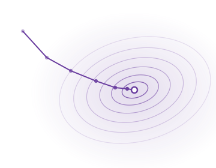

# What I'm learning

```{raw} html
<section class="kb-hero">
  <div class="kb-hero-text">
    <p>A running log of maths and AI I've been thinking about — papers I'm
       reading, proofs I want to rederive, ideas I'm turning over. Every entry
       is a live notebook.</p>
  </div>
  <div class="kb-hero-art">
    
  </div>
</section>
```

## 2026

```{raw} html
<ol class="kb-timeline">

  <li class="kb-entry kb-entry--left">
    <a class="kb-card" href="content/ai/infusion.html">
      <span class="kb-date">Apr 19</span>
      <span class="kb-tag kb-tag-paper">Paper</span>
      <h3 class="kb-title">Infusion: reverse-engineering influence functions</h3>
      <p class="kb-desc">Using influence functions in reverse to craft tiny
        training-data perturbations that steer model behaviour, with the
        derivations and a runnable logistic-regression demo.</p>
    </a>
  </li>

  <li class="kb-entry kb-entry--right">
    <a class="kb-card" href="content/maths/hvp.html">
      <span class="kb-date">Apr 10</span>
      <span class="kb-tag kb-tag-maths">Maths</span>
      <h3 class="kb-title">Hessian–vector products without forming the Hessian</h3>
      <p class="kb-desc">Why <code>∇(∇L · v)</code> gives you <code>Hv</code>
        for free, plus the Pearlmutter trick and when to reach for
        finite-difference HVPs instead.</p>
    </a>
  </li>

  <li class="kb-entry kb-entry--left">
    <a class="kb-card" href="content/maths/kronecker.html">
      <span class="kb-date">Mar 28</span>
      <span class="kb-tag kb-tag-maths">Maths</span>
      <h3 class="kb-title">Kronecker-factored approximations: K-FAC &amp; EKFAC</h3>
      <p class="kb-desc">Block-diagonal Fisher approximations that make
        second-order methods tractable for neural nets — and what "eigen"
        adds on top of K-FAC.</p>
    </a>
  </li>

  <li class="kb-entry kb-entry--right">
    <a class="kb-card" href="content/ai/grpo.html">
      <span class="kb-date">Mar 15</span>
      <span class="kb-tag kb-tag-ai">AI</span>
      <h3 class="kb-title">GRPO, demystified</h3>
      <p class="kb-desc">Group-Relative Policy Optimisation as PPO with the
        critic replaced by a group baseline — what it buys you, and where
        the approximation bites.</p>
    </a>
  </li>

  <li class="kb-entry kb-entry--left">
    <a class="kb-card" href="content/maths/fisher.html">
      <span class="kb-date">Feb 20</span>
      <span class="kb-tag kb-tag-maths">Maths</span>
      <h3 class="kb-title">The Fisher information matrix, four ways</h3>
      <p class="kb-desc">Score-covariance, expected-Hessian, Gauss–Newton,
        and empirical-Fisher definitions — when they agree, when they don't,
        and which one your natural-gradient code is actually using.</p>
    </a>
  </li>

  <li class="kb-entry kb-entry--right">
    <a class="kb-card" href="content/ai/loss-landscapes.html">
      <span class="kb-date">Feb 01</span>
      <span class="kb-tag kb-tag-note">Note</span>
      <h3 class="kb-title">Visualising loss landscapes</h3>
      <p class="kb-desc">Filter-normalised random 2-D slices through parameter
        space, why they can be misleading, and a minimal reproduction in
        PyTorch.</p>
    </a>
  </li>

</ol>
```

```{admonition} Adding a new entry
:class: tip dropdown
In `intro.md`, duplicate any `<li class="kb-entry ...">` block, update the
`href`, date, tag, title, and description. Alternate `kb-entry--left` and
`kb-entry--right` so the card sits on the correct side of the centre line.
For a new year, add a `## YEAR` heading and a fresh `<ol class="kb-timeline">`
below it — the homepage CSS styles any top-level H2 on this page as a sticky
pill. Tag classes: `kb-tag-ai`, `kb-tag-maths`, `kb-tag-paper`, `kb-tag-note`.
```
